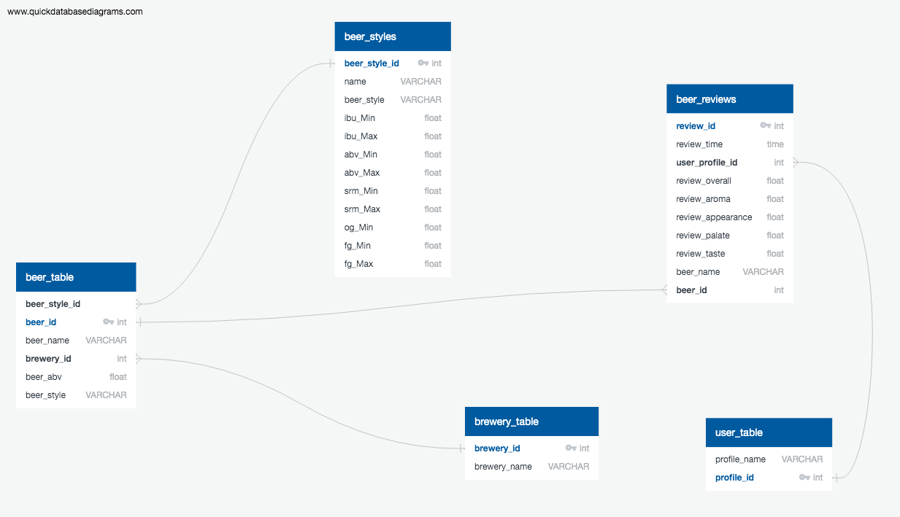

# This repo contains the code and presentation for  ETL project of the Data Analysis Bootcamp.

We gatter beer information from 2 diferent sources and built a data base of of it.

Tha data base was implements in postgresql and lloks like to following diagram:

## Requierements:

### Before trying to exeute the code make sure you have the following packages installed in python:

#### 1.- psycopg2

## The repo is divided into the following sections:

### 1.- SQL:
        Contain the erd diagram and the sql quieries to build the tables in postgresql
        
### 2.- JSON:
        Contains the code used to get the data from brewerydb.com and export it as csv file

### 3.- beer_reviews.csv:
        CSV data that contains the review data

### 4.- config.py:
 `Make sure to update this file with you data base credentials`
        Credentials to connect to the local postgresql data base

### 5.- beer_etl_app.ipynb:
        Main aplication that fetch the csv data process it and populate the data-base
